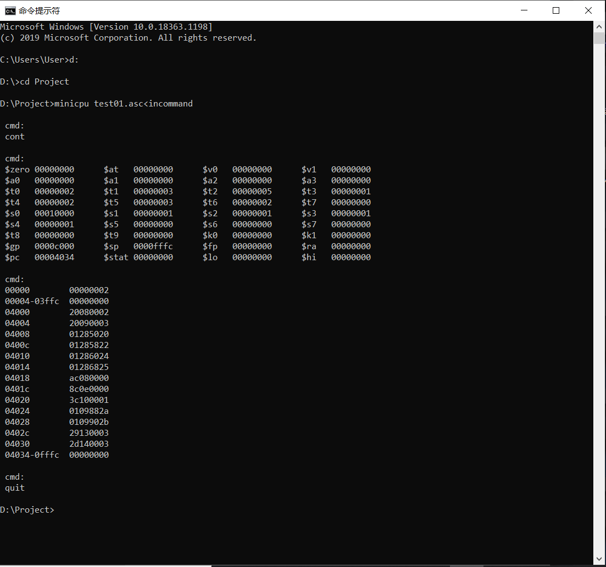
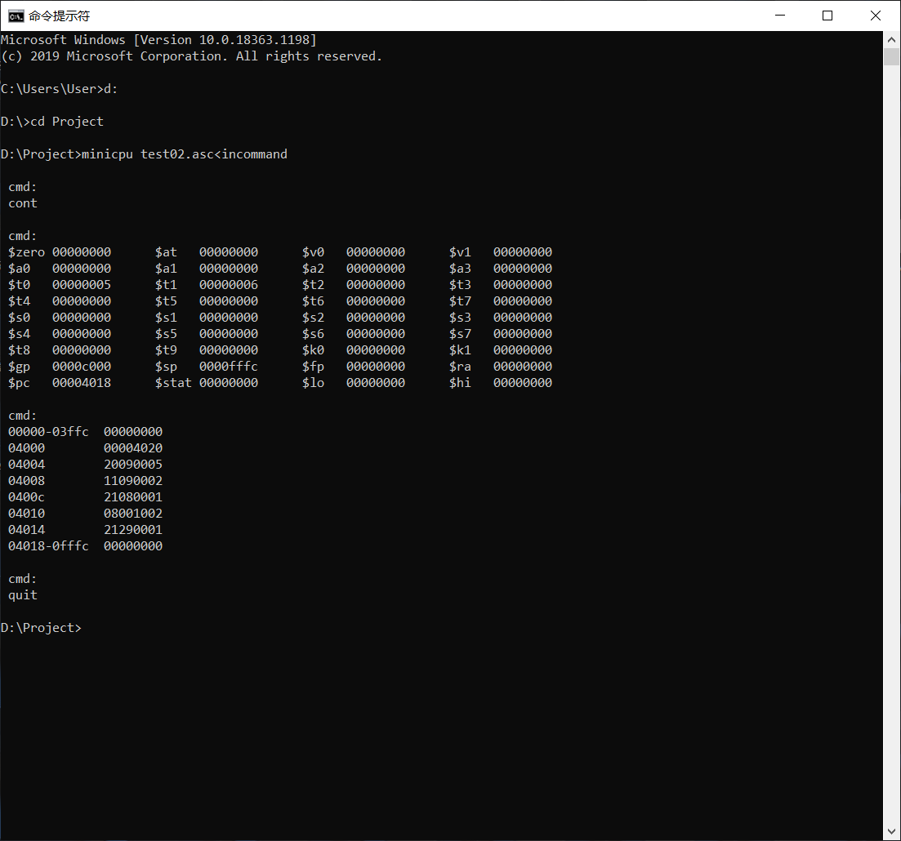

# minicpu

-----

>  Author: [@Hongbo Wang ](https://github.com/BOBWang1117)
>
>  

## **Environment:**

- Microsoft Visual Studio

  

## **Details**

- Type: term project
- Teacher: 梁延研
- Computer Language: C
- Project Name: mini CPU
- Time: 2020/11/29
- Description: In this project, you are going to implement a single cycle CPU simulator called MiniCPU using C language. Your MiniCPU will demonstrate some functions of MIPS processors as well as the principle of the datapath and the control signals. MiniCPU should read in a file containing MIPS machine codes (in the format specified below) and simulate what the MIPS processor does cycle-by-cycle. AC file called component.c will be provided to you which implementing each component of the single-cycle datapath, you are required to modify and fill in the body of the functions in this file.

## **Dependencies:** 

- None

## **Install package:**

- None

## **Run program:**

- minicpu test01.asc<incommand
- minicpu test02.asc<incommand

## **Example:**

1. 

   

2. 

   

